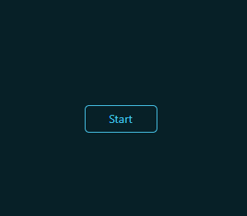
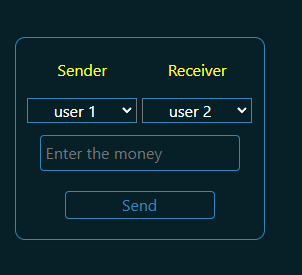
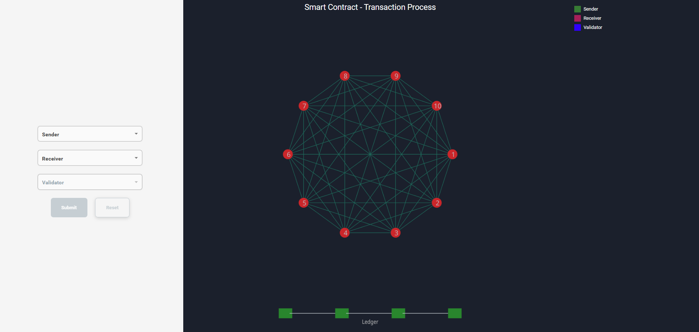
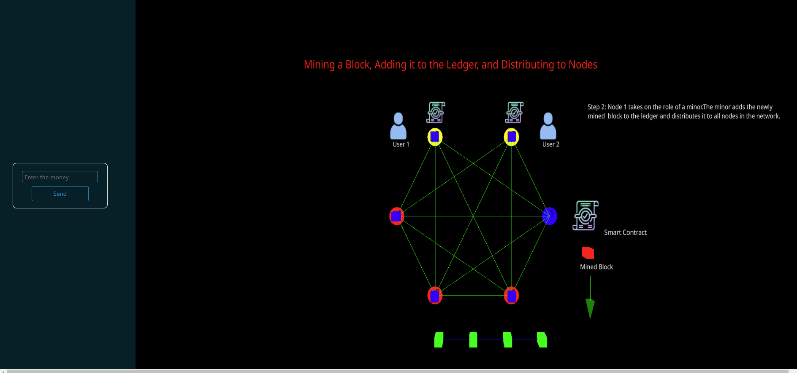

<h3>Procedure</h3>

1. Click the start button to begin the simulation

2. Enter the amount of money and click the submit button to proceed with the transaction from User 1 to User 2

3. Observe Step 1 of the animation. It shows the transaction initiation from User 1 to User 2

4. Observe the next step: Node 1 acts as a miner. The miner adds the mined block to the ledger and distributes it to all nodes in the network using a smart contract.

