
1. You can watch the animated video to learn how to create and deploy a smart contract, then click the Go to Simulation button to start the simulation.

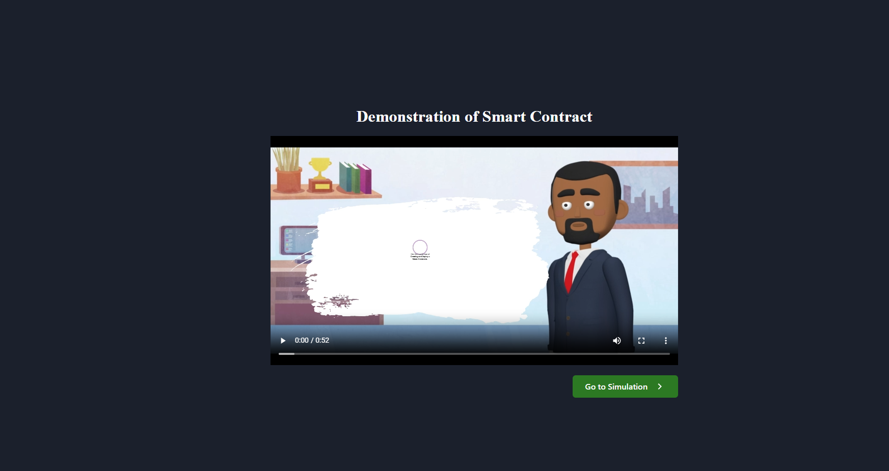

2. Click the Create Smart Contract button to create a smart contract.

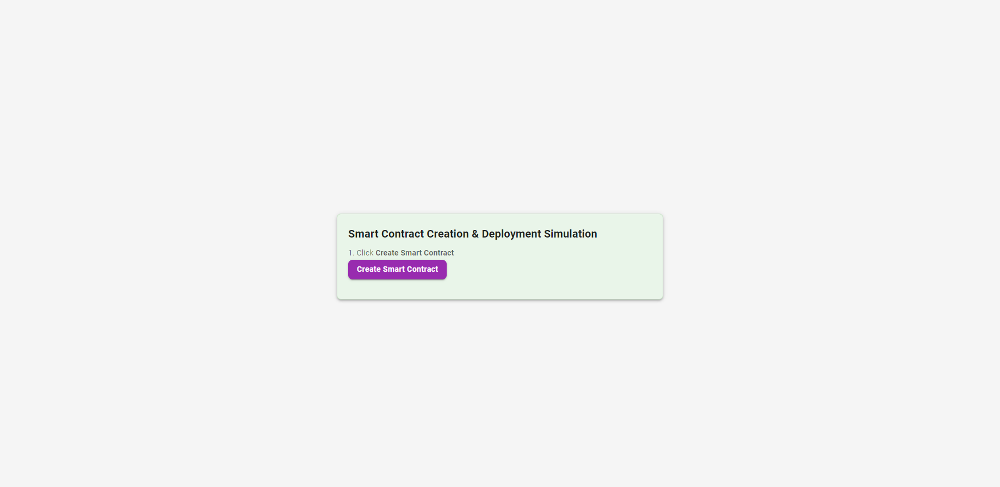

3. After creating the smart contract, you can view it in the right-side window. Click the Deploy button to deploy the created smart contract on the blockchain network.

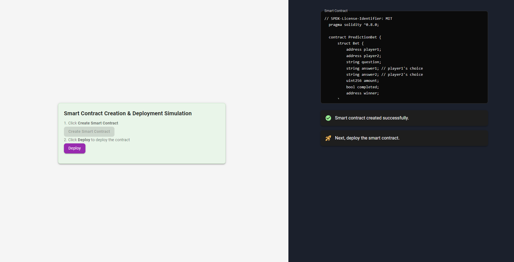

4. After clicking the Deploy button, the existing blockchain network will be shown.

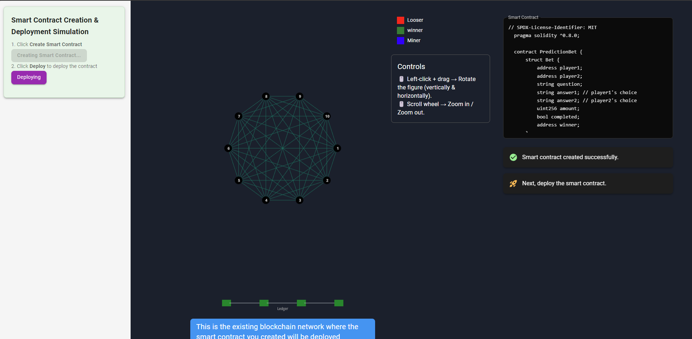

5. The smart contract is deploying in the existing blockchain network.

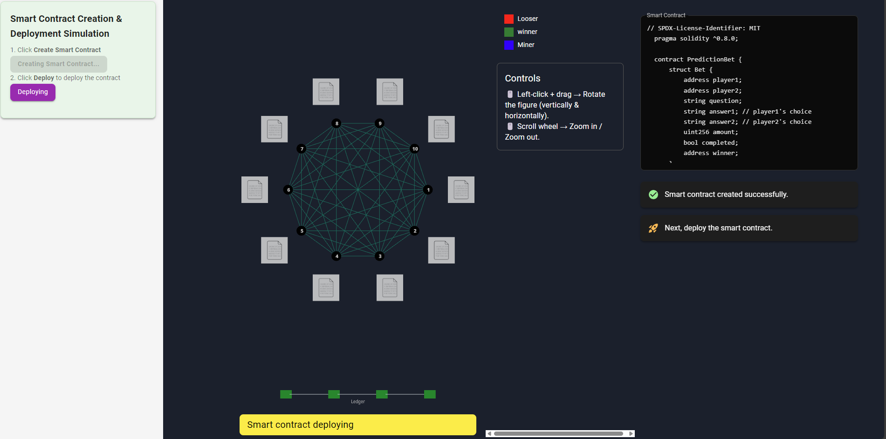

6. The smart contract is deployed successfully in the existing blockchain network. Now we introduce a betting game that works based on the deployed smart contract.

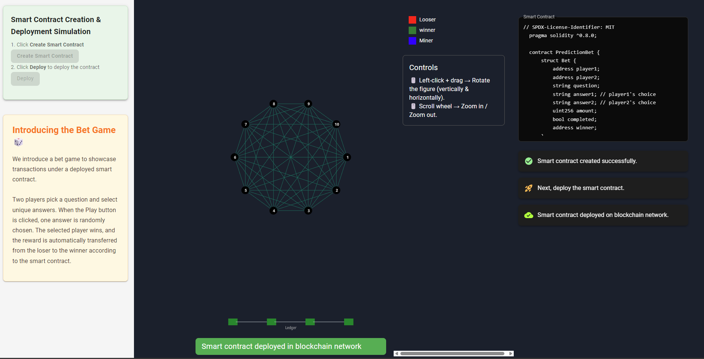

7.Move to the betting game with step-by-step instructions. The question for the game is recorded in the smart contract, and players’ responses will be stored through the contract’s data addition function.

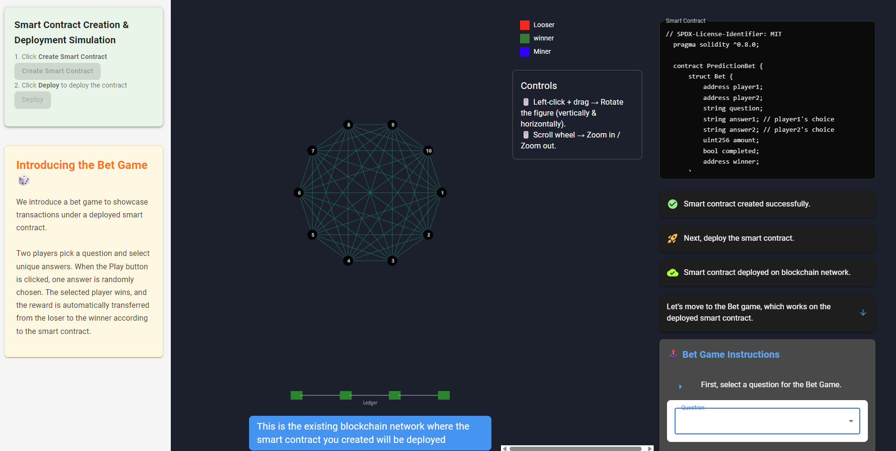

8. Then choose two players for the betting game and their unique answers to the question. (The 10 blocks in the blockchain network represent the players of the betting game.)

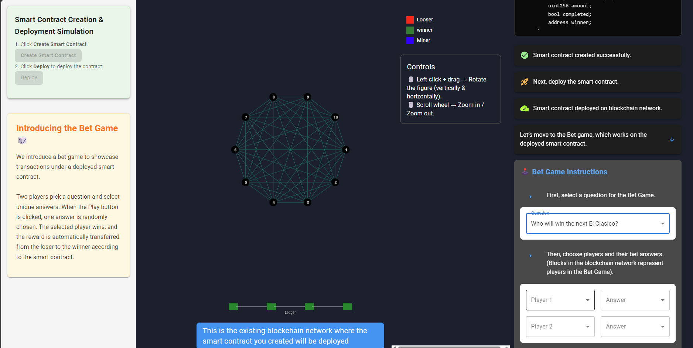

9. When you click the Play button, the smart contract retrieves the players’ stored answers and applies the game logic to randomly select one as the winning answer.

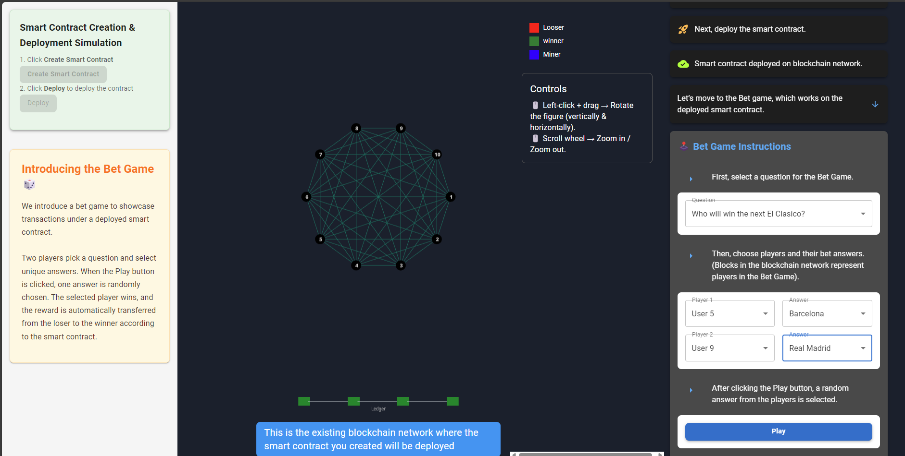

10. After clicking the Play button, the smart contract compares the retrieved data and determines the winner (green) and loser (red). The contract then initiates a transaction, transferring reward coins from the loser’s balance to the winner.

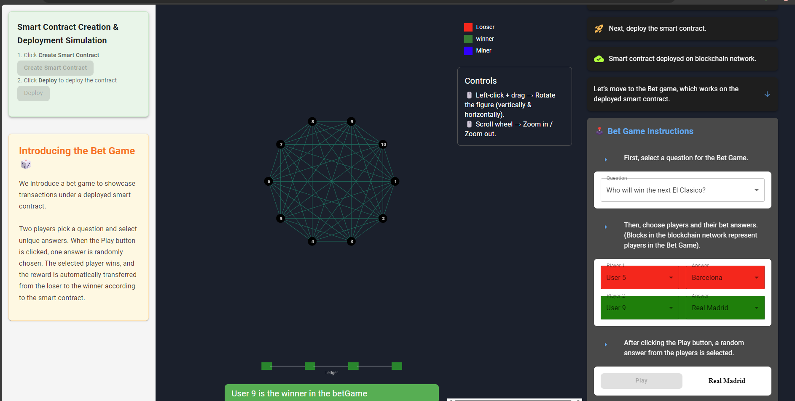

11. Click the Find Miner button to find a miner with more mining power from the blockchain network to mine the transaction between the loser and the winner.

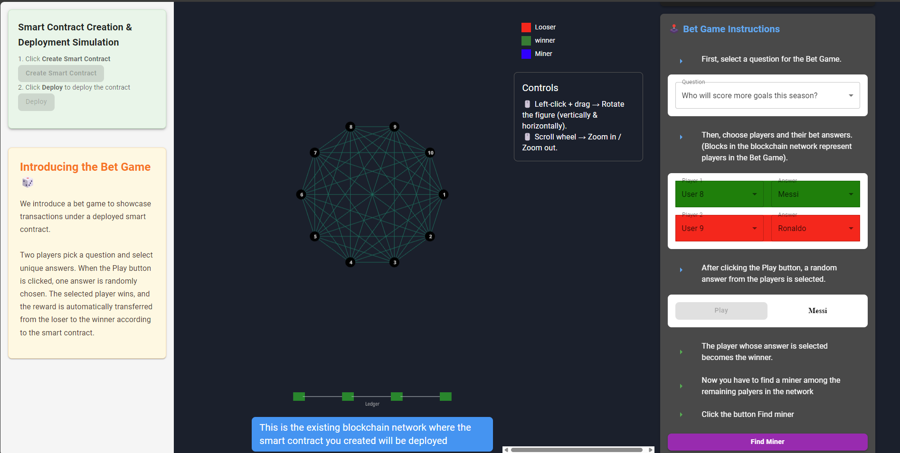

12. Finding miners in the network.

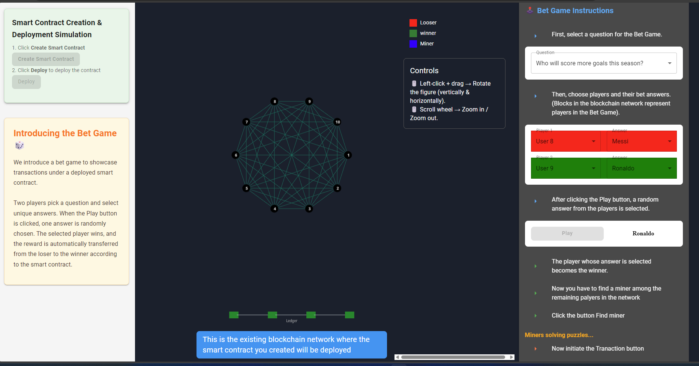

13. One of the other players who is not participating in the betting game is selected as the miner. Then click the Initiate Transaction button to send the reward money from the loser to the winner.

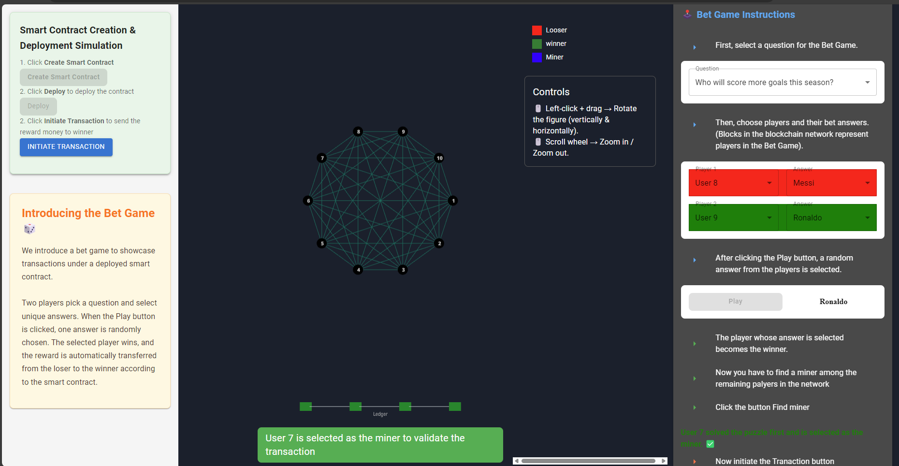

14. The transaction starts: the loser is sending the reward coin to the winner (loser block labeled in red and winner block labeled in green).

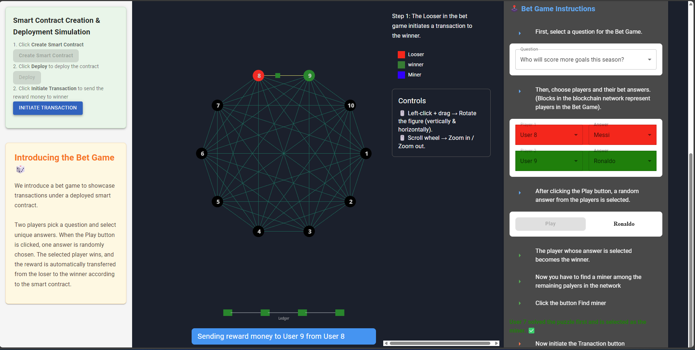

15. The selected miner is verifying the transaction...

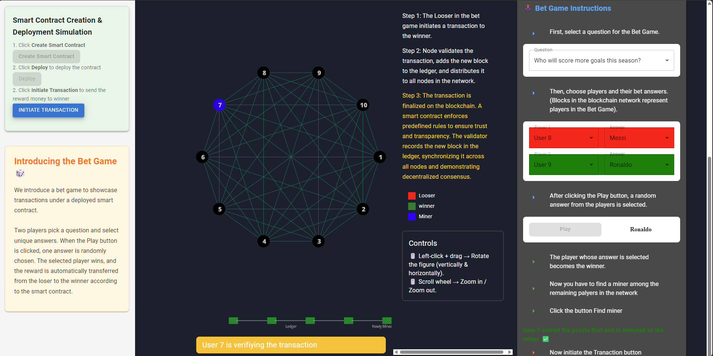

16. The miner broadcasts the verification results to the other blocks in the network.

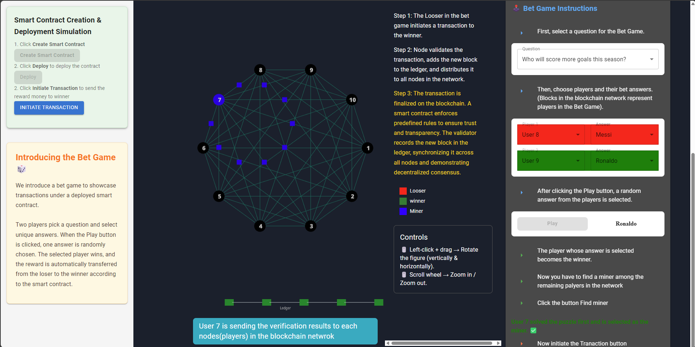

17. Transaction completed.

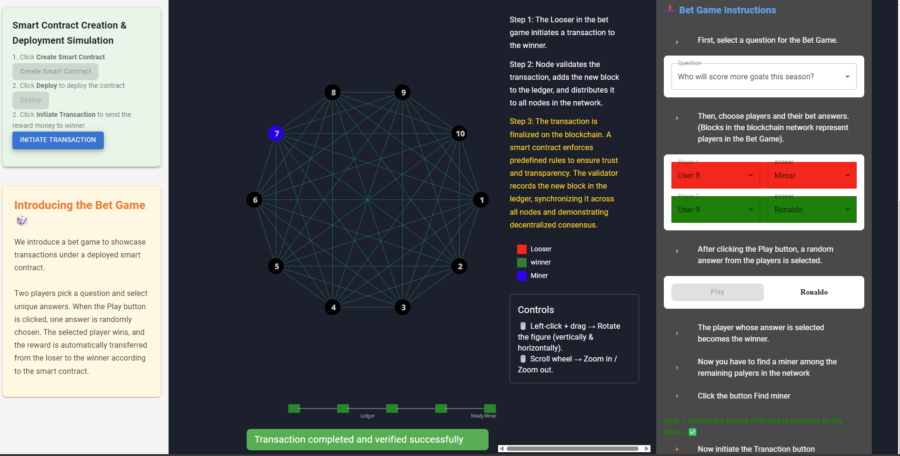
