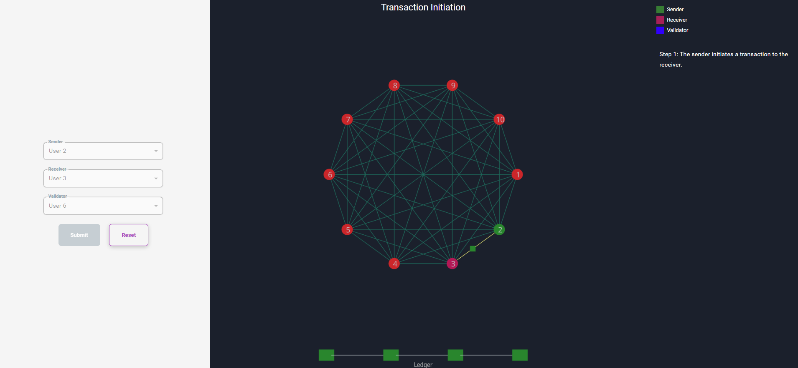
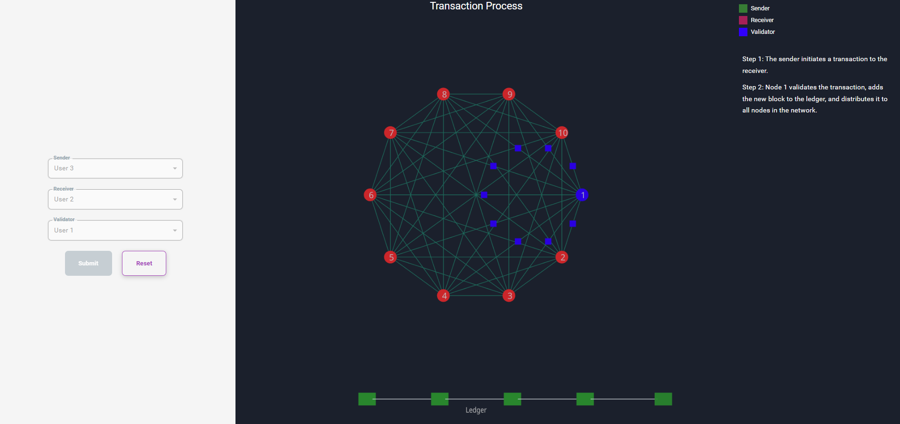

<h3>Procedure</h3>

2. Choose the Sender, Receiver, and Validator from the given dropdown, then click the Submit button to initiate the transaction.

3. Observe Step 1 of the animation. It shows the transaction initiation from the Sender to the Receiver.

4. Observe the next step: The selected node acts as a Validator. The Validator adds the mined block to the ledger and distributes it to all nodes in the network using a smart contract.

