<!-- <h3>Procedure</h3>

1.You can watch the animated video help to connect Smart contract creating and deploying and click the Go to simulation button to start the simulation

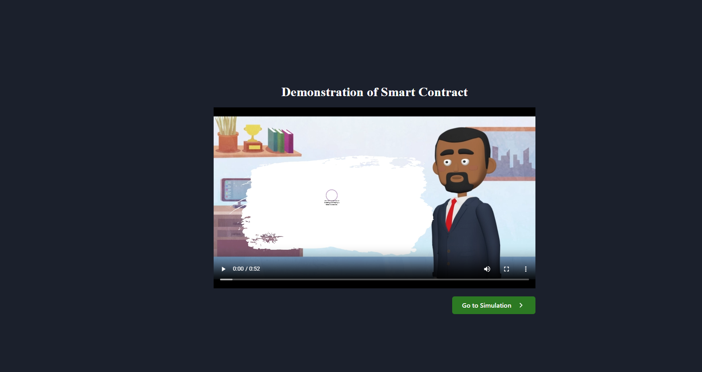

2.Click the button create smart contract to create a smart contract  

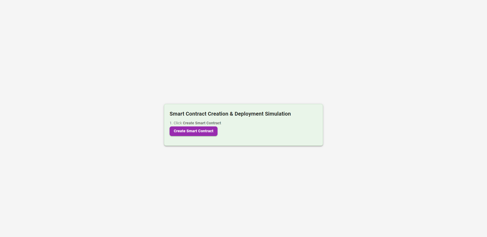

3.Successfully created smart contract , you can view the smart contract on the right side window and click the deploy button to deploy the created smart contract on blockchain network

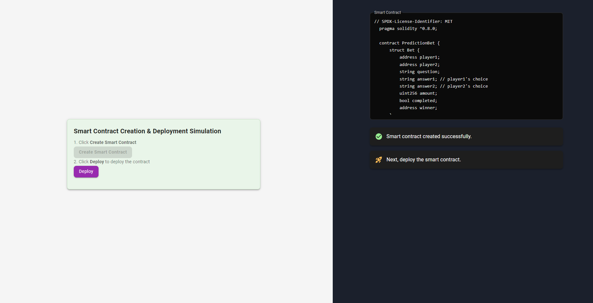

4.After clicking deploy button initially showing existing blockchain network

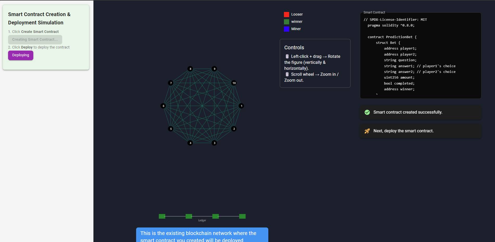

5.Smart contract deploying in existing blockchain network 

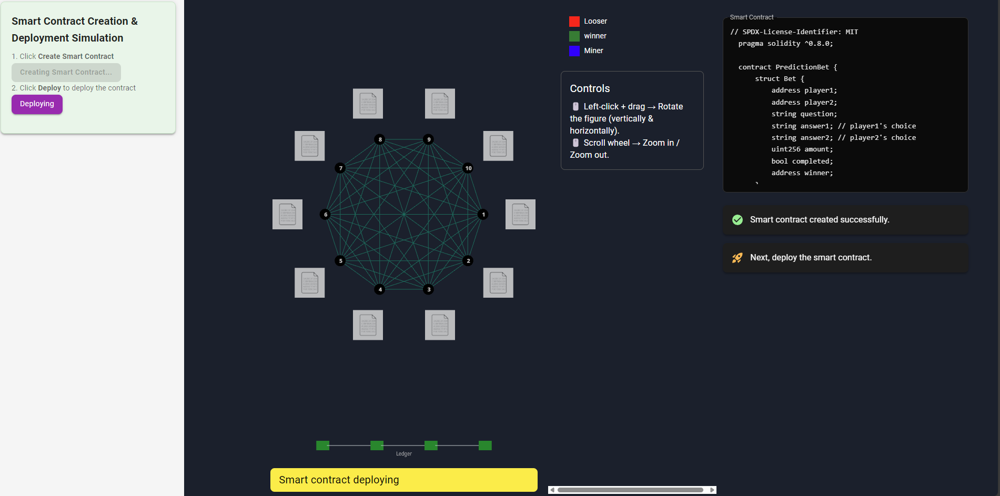

6.Smart contract deployed successfully  in existing blockchain network and we introducing a bet game which works based on the deployed samrt contract 

7.Move to the bet game with step by step instructions.First select the question for the bet game

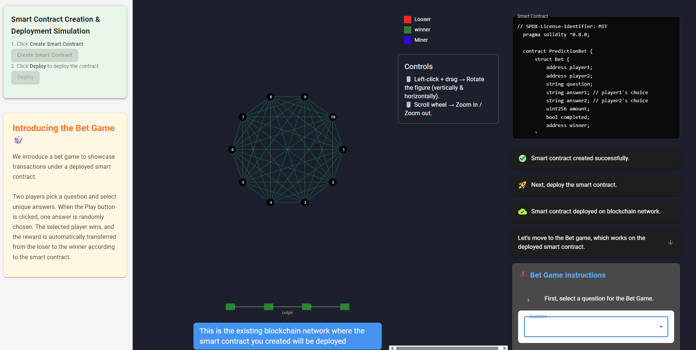

8.Then choose players for the the bet game and their unique answer for the question (two players at a time and the 10 block in blockchain network representing the players of bet game) 

9.System selects randomly one answer from players input when click the play button

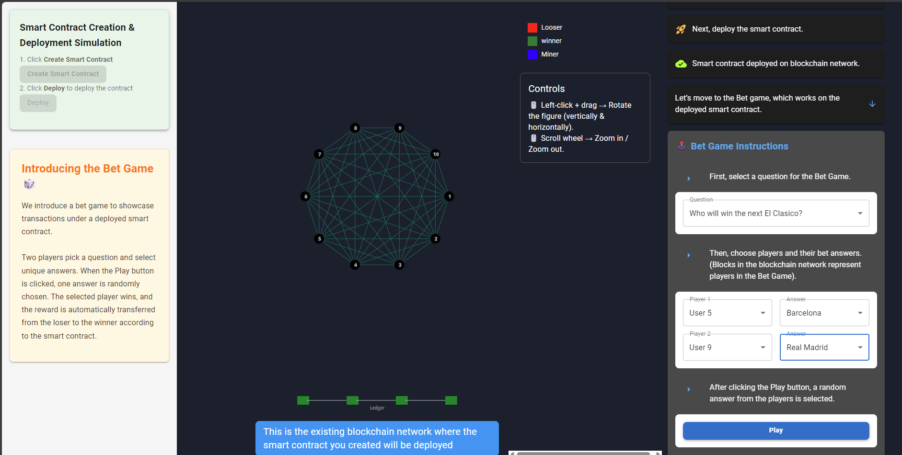

10.After clicked play button shows selected answer and also woned player is labelled in green color and loosed player lablled in red color.And the looser send a transaction to the  winner as reward coin   

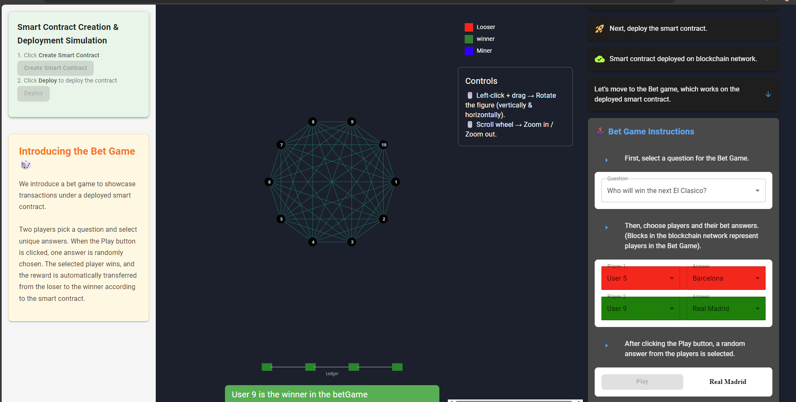

11.Click the button Find miner which find a miner who have more mining power from the blockchain network to mine the transaction between the miner and looser

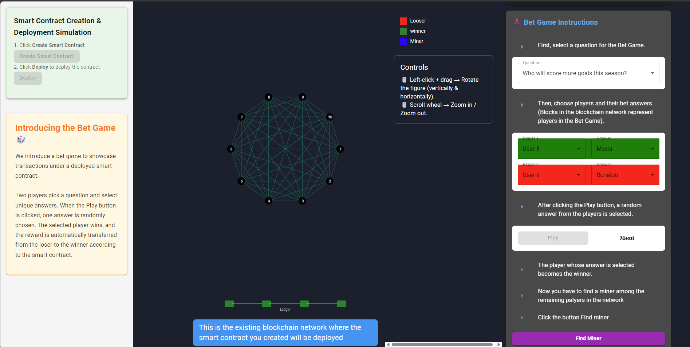

12.Finding miners in network

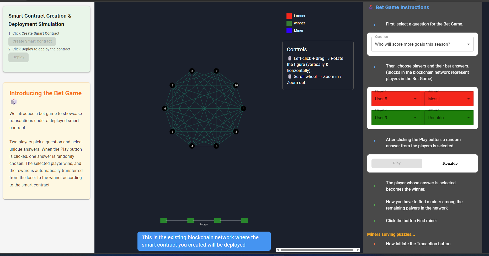

13..One of the other players who are not participating int the bet game is selected as miner.Then click Initiate transaction button to send the reward money to winner from looser

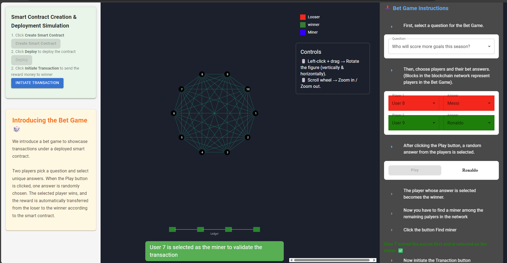

14.Transaction started looser sending reward coin to winner (Looser block labelled in red color and winner block labelled in green color )

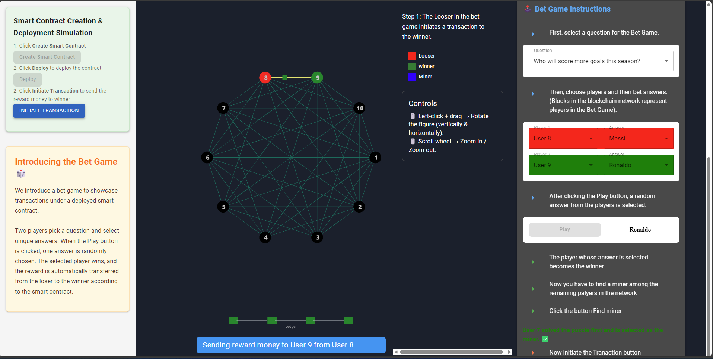

15. Selected miner verifying the transaction....

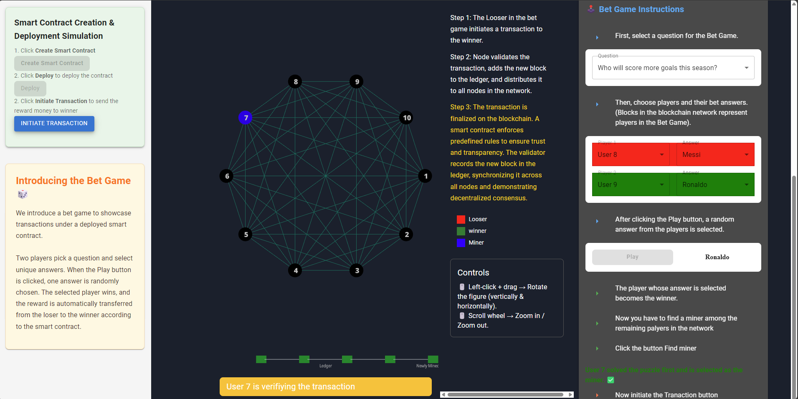

16. Miner broadcast the verification results to the other blocks in network

17. Transaction completed

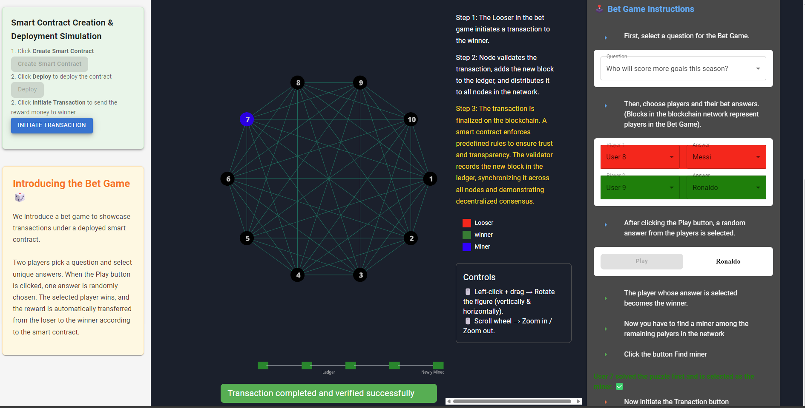
 -->

1. You can watch the animated video to learn how to create and deploy a smart contract, then click the Go to Simulation button to start the simulation.

2. Click the Create Smart Contract button to create a smart contract.

3. After creating the smart contract, you can view it in the right-side window. Click the Deploy button to deploy the created smart contract on the blockchain network.

4. After clicking the Deploy button, the existing blockchain network will be shown.

5. The smart contract is deploying in the existing blockchain network.

6. The smart contract is deployed successfully in the existing blockchain network. Now we introduce a betting game that works based on the deployed smart contract.

7.Move to the betting game with step-by-step instructions. The question for the game is recorded in the smart contract, and players’ responses will be stored through the contract’s data addition function.

8. Then choose two players for the betting game and their unique answers to the question. (The 10 blocks in the blockchain network represent the players of the betting game.)

9. When you click the Play button, the smart contract retrieves the players’ stored answers and applies the game logic to randomly select one as the winning answer.

10. After clicking the Play button, the smart contract compares the retrieved data and determines the winner (green) and loser (red). The contract then initiates a transaction, transferring reward coins from the loser’s balance to the winner.

11. Click the Find Miner button to find a miner with more mining power from the blockchain network to mine the transaction between the loser and the winner.

12. Finding miners in the network.

13. One of the other players who is not participating in the betting game is selected as the miner. Then click the Initiate Transaction button to send the reward money from the loser to the winner.

14. The transaction starts: the loser is sending the reward coin to the winner (loser block labeled in red and winner block labeled in green).

15. The selected miner is verifying the transaction...

16. The miner broadcasts the verification results to the other blocks in the network.

17. Transaction completed.

