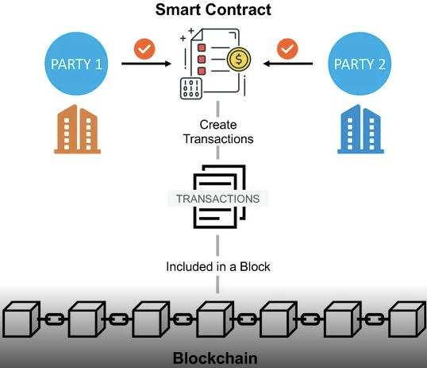

### Theory 
<h5>Smart Contract
</h5>
A smart contract is a computer program or a transaction protocol that is intended to automatically execute, control or document events and actions according to the terms of a contract or an agreement. Smart contracts are typically stored on a blockchain, which is a distributed ledger that is secure and tamper-proof.
  

    

<h5>How does the smart contract works</h5>

A smart contract is a sort of program that encodes business logic and operates on a dedicated virtual machine embedded in a blockchain or other distributed ledger.

  
   Step 1: Business teams collaborate with developers to define their criteria for the smart contract's desired behavior in response to certain events or circumstances.

 
    
    Step 2: Conditions such as payment authorization, shipment receipt, or a utility meter reading threshold are examples of simple events.
    

    
    Step 3: More complex operations, such as determining the value of a derivative financial instrument, or automatically releasing an insurance payment, might be encoded using more sophisticated logic.
    

    
    Step 4: The developers then use a smart contract writing platform to create and test the logic. After the application is written, it is sent to a separate team for security testing.
    

    
    Step 5: An internal expert or a company that specializes in vetting smart contract security could be used.
    

    
    Step 6: The contract is then deployed on an existing blockchain or other distributed ledger infrastructure once it has been authorized.
    

    
    Step 7: The smart contract is configured to listen for event updates from an "oracle," which is effectively a cryptographically secure streaming data source, once it has been deployed.
    

    
    Step 8: Once it obtains the necessary combination of events from one or more oracles, the smart contract executes.

    
    
    
    
    
