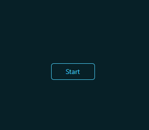
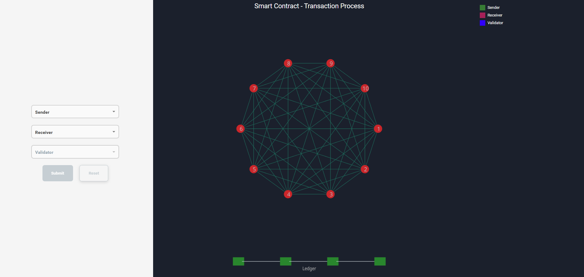

<h3>Procedure</h3>

1.Click the start button to start the simulation

2.Enter the Money and click the submit button to proceed the transaction of money from user 1to user 2

3.Observe the step 1 of animation.It shows the transaction initiation from user 1 to user 2

4.Observe the next step,node 1 act as minor ,Minor add the mined bock to the ledger and distributes it to all nodes in the network using smart contract. 

